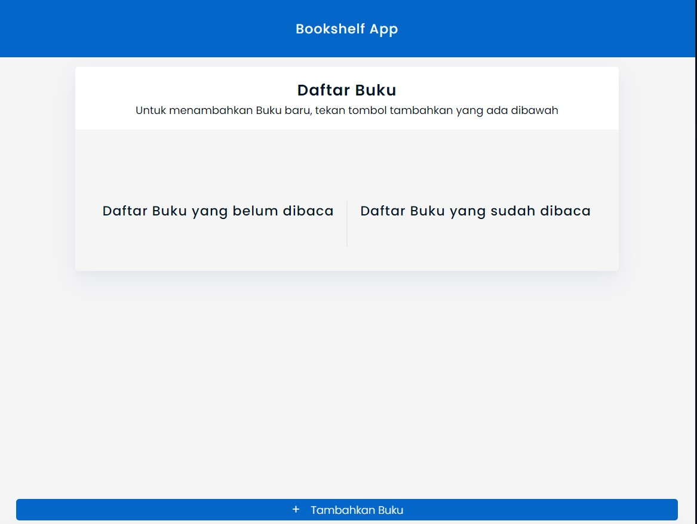

<h1 align="center">Bookshelf App</h1>

Bookshelf App adalah website dinamis untuk mengelola Buku. Dibuat menggunakan JavaScript dan SASS.
Ini merupakan hasil untuk submission project akhir Dicoding Academy dalam modul Belajar Membuat Front-End Web untuk Pemula.

## Links

- [Repo](https://github.com/mlnzyz/bookshelfApp "Bookshelf App")
- [Demo](https://bookshelfapp.vercel.app "Demo")

## Screenshots

## Dibuat dengan

- JavaScript
- SASS

**Rizki Maulana Citra**

- [Profile](https://github.com/mlnzyx "Rizki Maulana Citra")
- [Email](mailto:iniakunya7@gmail.com?subject=Hi "Sapa Saya!")
- [Website](https://rizkidev.vercel.app "Kunjungi Website saya")
